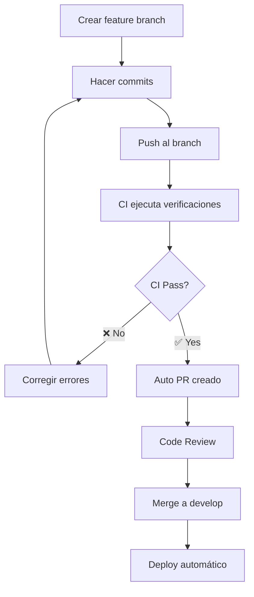

# 🚀 CI/CD Pipeline - Gateway Service

Este documento explica cómo funciona el sistema de Integración Continua (CI) y Deployment Continuo (CD) para el servicio Gateway.

## 📋 Workflows Disponibles

### 1. 🔍 `ci.yml` - Continuous Integration

- **Trigger:** Push y PR a `main` y `develop`
- **Propósito:** Verificar calidad del código en cada cambio

**¿Qué hace?**

- ✅ Lint del código (ESLint)
- ✅ Verificación de formato (Prettier)
- ✅ Compilación del proyecto
- ✅ Tests unitarios
- ✅ Tests e2e
- ✅ Análisis de cobertura de tests
- ✅ Audit de seguridad de dependencias
- ✅ Test de construcción Docker

### 2. 📝 `auto-pr.yml` - Auto Pull Request + CI

- **Trigger:** Push a ramas `feature/*`, `feat/*`, `bugfix/*`, `hotfix/*`
- **Propósito:** Ejecutar CI y crear PR automáticamente

**Flujo:**

1. **CI Job:** Ejecuta todas las verificaciones de calidad
2. **PR Job:** Si CI pasa ✅, crea PR automáticamente hacia `develop`

### 3. 🚀 `deploy.yml` - Deployment

- **Trigger:** Push a `develop`
- **Propósito:** Deploy automático al ambiente de desarrollo

## 🔄 Flujo de Desarrollo



## 📊 ¿Qué verificaciones hace CI?

### 🔍 **Análisis de Código**

```bash
# Linting - Verifica estilo y buenas prácticas
pnpm run lint

# Formato - Verifica formato consistente
pnpm run format --check
```

### 🏗️ **Compilación**

```bash
# Build del proyecto
pnpm run build
```

### 🧪 **Testing**

```bash
# Tests unitarios
pnpm run test

# Tests end-to-end
pnpm run test:e2e

# Cobertura de tests
pnpm run test:cov
```

### 🔐 **Seguridad**

```bash
# Audit de dependencias vulnerables
pnpm audit --audit-level high
```

### 🐳 **Docker**

```bash
# Test de construcción de imagen Docker
docker build -t gateway-test .
docker run --rm -d gateway-test
```

## 🛠️ Configuración del Pipeline

### Variables de Entorno Necesarias

| Variable        | Descripción                      | Requerido |
| --------------- | -------------------------------- | --------- |
| `GITHUB_TOKEN`  | Token automático para crear PRs  | ✅        |
| `CODECOV_TOKEN` | Para subir reportes de cobertura | ❌        |

### Archivos de Configuración

| Archivo                         | Propósito                           |
| ------------------------------- | ----------------------------------- |
| `.github/workflows/ci.yml`      | CI principal                        |
| `.github/workflows/auto-pr.yml` | Auto PR + CI                        |
| `.github/workflows/deploy.yml`  | Deployment                          |
| `audit-ci.json`                 | Configuración de audit de seguridad |

## 🚀 Cómo usar el pipeline

### Para desarrolladores:

1. **Crear feature branch:**

   ```bash
   git checkout -b feature/nueva-funcionalidad
   ```

2. **Desarrollar y hacer commits:**

   ```bash
   git add .
   git commit -m "feat: agregar nueva funcionalidad"
   ```

3. **Push del branch:**

   ```bash
   git push origin feature/nueva-funcionalidad
   ```

4. **¡El pipeline hace el resto!** 🎉
   - CI ejecuta todas las verificaciones
   - Si todo está bien ✅, se crea PR automáticamente
   - Si hay errores ❌, se notifican en el PR

### Estados del Pipeline:

| Estado         | Significa     | Acción                  |
| -------------- | ------------- | ----------------------- |
| 🟢 **Passed**  | Todo correcto | Listo para merge        |
| 🔴 **Failed**  | Hay errores   | Revisar logs y corregir |
| 🟡 **Running** | Ejecutándose  | Esperar a que termine   |

## 📈 Monitoreo y Reports

### Cobertura de Tests

- Se genera automáticamente en cada CI run
- Disponible en los artifacts del workflow
- Comentarios automáticos en PRs con cambios de cobertura

### Security Audit

- Revisa dependencias por vulnerabilidades conocidas
- Falla el CI si hay vulnerabilidades críticas o altas
- Reportes disponibles en los logs del workflow

## 🔧 Troubleshooting

### ❌ CI falla en Lint

```bash
# Ejecutar localmente para ver errores
pnpm run lint

# Auto-fix errores simples
pnpm run lint -- --fix
```

### ❌ Tests fallan

```bash
# Ejecutar tests localmente
pnpm run test

# Tests en modo watch para desarrollo
pnpm run test:watch

# Tests e2e
pnpm run test:e2e
```

### ❌ Build falla

```bash
# Verificar build local
pnpm run build

# Verificar dependencias
pnpm install
```

### ❌ Docker build falla

```bash
# Test local de Docker build
docker build -f dockerfile -t gateway-test .

# Verificar que el container arranca
docker run --rm -p 3000:3000 gateway-test
```

## 📚 Mejores Prácticas

### ✅ Do's

- Ejecutar `pnpm run lint` y `pnpm run test` antes de push
- Escribir commits descriptivos siguiendo conventional commits
- Mantener cobertura de tests alta (>80%)
- Revisar logs de CI cuando algo falla

### ❌ Don'ts

- No hacer push directo a `main` o `develop`
- No ignorrar warnings de linting
- No hacer merge sin que CI pase
- No commitear código con tests rotos

## 🎯 Próximos Pasos

- [ ] Configurar Codecov para mejor tracking de cobertura
- [ ] Agregar performance tests
- [ ] Configurar deploy automático a staging/production
- [ ] Agregar notificaciones Slack/Discord
- [ ] Implementar feature flags para releases graduales

---

🤖 **Este pipeline fue generado automáticamente por GitHub Copilot**
